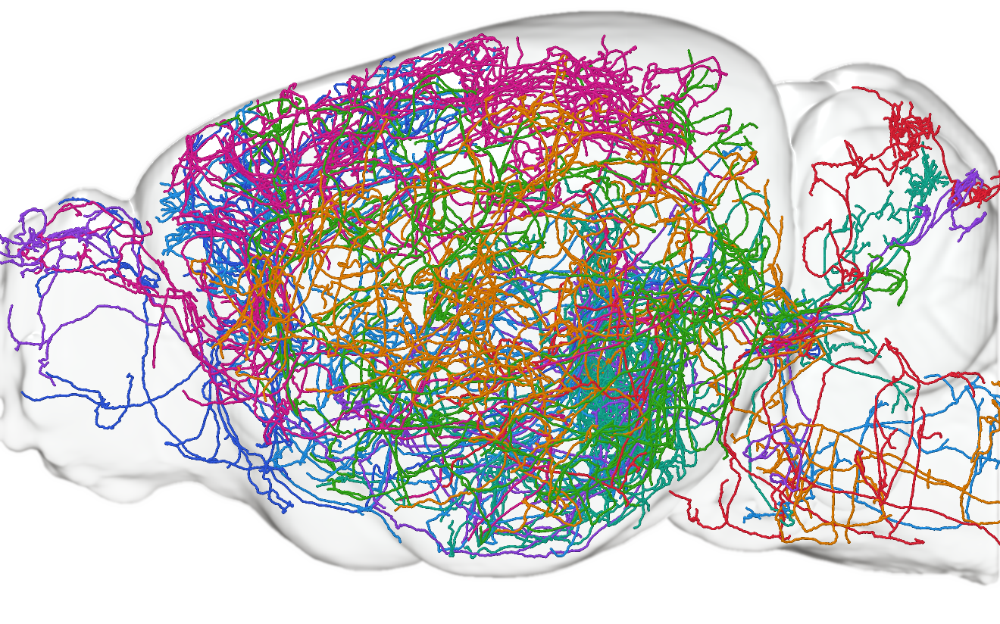
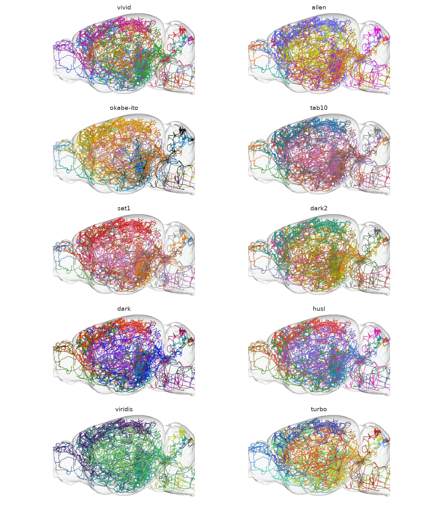

# ccf-glass-render


Glass renders of the Allen Mouse Common Coordinate Framework with single-neuron
reconstructions inside.



The brain is shaded as a transparent dielectric — Fresnel mixing of a reflected
studio environment against a refracted backdrop, with chromatic dispersion,
far-wall contours and procedural surface irregularity. Neurons are drawn as z-buffered 3D tubes composited over it.

## Install

```bash
uv pip install git+https://github.com/peter-grotz/single-neuron-reconstruction-visualization.git
```

## Use

Each camera is rendered once
and cached; figures then composite onto it in seconds.

```bash
ccf-render brain --views sagittal,iso --resolution 10

ccf-render cells \
  --asset s3://aind-open-data/exaSPIM_685221_2024-04-12_11-46-38_reconstructions_2026-08-28_23-04-54 \
  --views sagittal,iso --sample 8 --label LC --out figures/
```

`--asset` accepts an S3 reconstruction asset or a local directory and repeats,
so several subjects can share a figure. Each run writes PNG and SVG per view,
plus `provenance.json` recording the input assets, package version and profile
digest.

| Flag | Effect |
|---|---|
| `--compartment axon\|dendrite\|soma` | Restrict to one compartment; dendrite carries the soma |
| `--cell ID` | Named cells, repeatable |
| `--sample N` | Seeded random subset |
| `--resolution` | Pixel size in µm, a multiple of 10 |
| `--colors NAME` | Per-cell colour scheme (below) |
| `--thickness N` | Tube radius in 20 µm pixels; default 1.15 |
| `--structure ACR` | Show a CCF structure inside the brain (below) |
| `--profile FILE` | TOML overriding any shader, palette or geometry constant |

## Colour schemes

`--colors` sets how cells are coloured. Every scheme is chosen to read against
the white glass; pale hues disappear on it.

| Scheme | |
|---|---|
| `vivid` | high-chroma hues around the circle (default) |
| `allen` | Allen Institute brand primaries and accents |
| `okabe-ito` | colour-vision-deficiency safe |
| `tab10`, `set1`, `dark2` | matplotlib default and two ColorBrewer qualitative sets |
| `dark`, `husl`, `viridis`, `turbo` | generated for any cell count |

Fixed schemes cap a figure at their length and raise rather than reusing a hue
on two cells; the generated schemes size themselves to the selection. A profile
may instead give `palette` as explicit hex values, which overrides the scheme.

The same eight cells under each scheme:



`viridis` is included because it is asked for, but it is perceptually ordered,
so adjacent cells land on adjacent hues and are hard to tell apart. For
categorical work prefer `vivid`, `allen` or `okabe-ito`.

## Line weight

`--thickness` is the tube radius in 20 µm pixels, held constant in apparent
size as resolution changes. The default of 1.15 suits a full-page figure; 2–3
reads better in a thumbnail or a slide, where thin processes otherwise drop out
at display size.

```bash
ccf-render cells --asset … --thickness 2.5 --sample 4
```

## CCF structures

`--structure` draws a labelled region inside the glass, so projections can be
read against anatomy. Structures take their official CCF colour unless given
one, and a parent acronym expands to all its descendants — `TH` is the union of
74 thalamic labels, not the handful of voxels tagged 549 itself.

```bash
ccf-render find thalamus                 # search acronyms and names
ccf-render structures --structure MD --views sagittal --resolution 10
ccf-render cells --asset … --structure MD
```

Overlays are cached per view, resolution and structure set, independently of
the brain, so adding a region does not rebuild the glass. Neurons deeper than a
structure's near surface are attenuated by its thickness, so a cell inside a
nucleus reads as inside rather than painted over it.

## Resolution

`--resolution 10` is the native template sampling; 20 µm is ~8× cheaper and
adequate while composing a figure. A 10 µm build rotates 1.2 × 10⁹ voxels. The
occupancy and its rotation (4.8 GB each) are memory-mapped rather than held
resident, which keeps the resample at minutes instead of hours on a 19 GB
machine; it needs ~10 GB of scratch disk, released on completion.

## Reconstruction formats

Both exaSPIM SWC conventions are read, distinguished by inspection rather than
assumption:

- **split** — one file per compartment (`<cell>-axon-<INITIALS>.swc`), type
  column uniformly 0, compartment carried by the filename.
- **combined** — one file per cell with standard SWC type codes.

Reading the type column without this check fails silently: every node in a
split file is "undefined", and a compartment filter returns nothing.

## Atlas

`average_template_10` is fetched from the Allen informatics archive on first
use, cached under `~/.cache/ccf-glass-render` (`CCF_CACHE` overrides), and
shape-checked, since a different atlas or axis order would otherwise yield a
silently misoriented render. Coordinates are CCF microns on array axes
(anterior–posterior, inferior–superior, left–right); midline is z = 5700 µm.

## Development

```bash
uv venv && uv pip install -e ".[dev]"
ruff check . && pytest
```

MIT. Not an officially supported Allen Institute product.

## Code Ocean

The repository doubles as a Code Ocean capsule. `environment/Dockerfile` installs
the renderer from a pinned commit of this repository, and `code/run` passes App
Panel parameters to `code/app.py`.

Reconstruction assets are attached in the App Panel; the capsule finds their SWC
files automatically. A second asset holds the prerendered glass views, so a run
costs seconds rather than rebuilding the brain. Build that asset once with
`mode = build_cache`, which writes `/results/ccf_cache`, then create a data asset
from the run and attach it to every later run.

| Panel parameter | Default |
|---|---|
| `mode` | `render`, or `build_cache` to make the cache asset |
| `views` | `sagittal,iso` |
| `resolution` | `10` |
| `colors` | profile default (`vivid`) |
| `thickness` | profile default (`1.15`) |
| `compartment` | `all` |
| `structure` | none |
| `cells`, `sample`, `seed` | all cells, unseeded subset off |
| `label`, `dpi`, `formats` | `cells`, `300`, `png,svg` |
